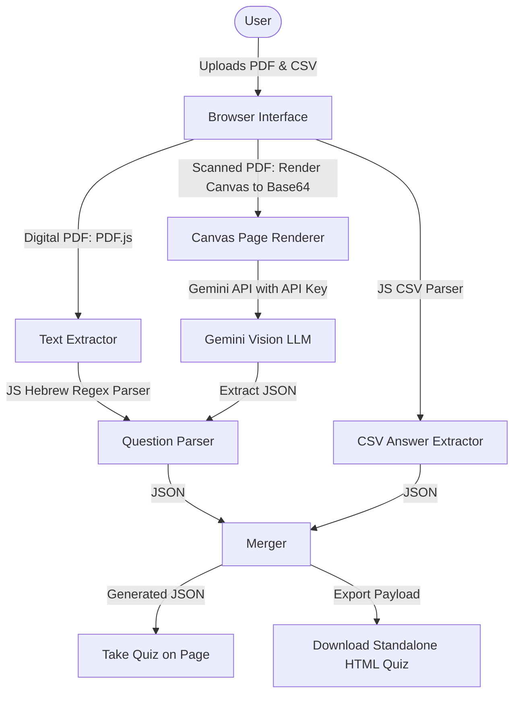
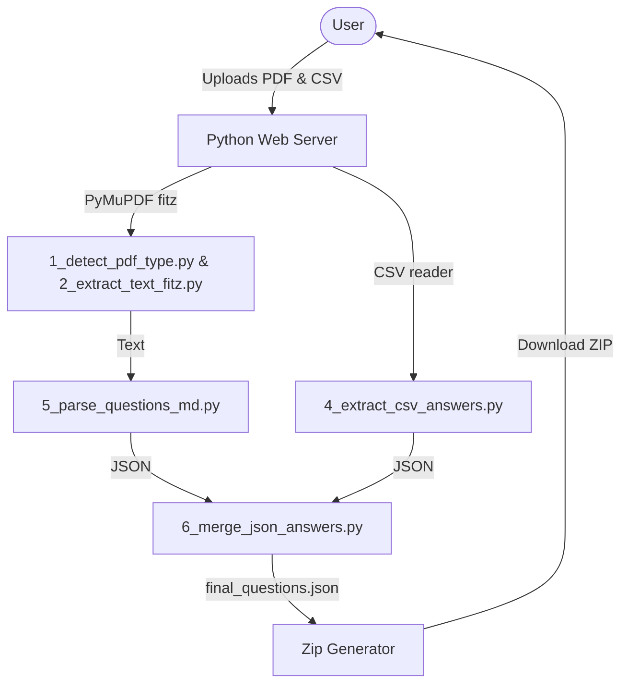

# Proposal: Web-Based Interactive Quiz Generator

This document outlines options for building an application that lets users upload a Hebrew exam PDF and a student answers CSV to generate an interactive quiz.

---

## Technical Options

### Option A: Pure Client-Side Static Web App (Recommended)
A single-page static HTML/JS/CSS tool that processes everything in the browser. 

#### How it works:
1. **PDF Text Extraction**:
   - **For Digital PDFs**: Uses **PDF.js** (`pdfjs-dist`) client-side in the browser to extract raw text lines.
   - **For Scanned PDFs (Images)**: The app renders each PDF page to an HTML Canvas, exports it as a Base64 PNG, and sends it directly to the **Gemini 1.5 Flash/Pro API** using an API Key provided by the user. The model processes the Hebrew text visually and returns structured question JSON.
2. **Text Reversal & Regex parsing**: Implements the Hebrew line word-order reversing logic and question regex patterns directly in JavaScript.
3. **CSV Parsing**: Uses a lightweight parser (or a library like **PapaParse**) to read the CSV rows and locate the selected test form column.
4. **Interactive Quiz**:
   - **Take Quiz**: Launches the interactive quiz interface on the same page instantly.
   - **Download Standalone Quiz**: Bundles the code from [index.html](file:///c:/Users/elon/Documents/GitHub/test/index.html), [style.css](file:///c:/Users/elon/Documents/GitHub/test/style.css), and [app.js](file:///c:/Users/elon/Documents/GitHub/test/app.js) alongside the generated `questions` data into a single, self-contained HTML file that the user can save locally.

#### Pros:
* **Zero Server/Hosting Cost**: Can be hosted on GitHub Pages or Vercel completely free.
* **Privacy & Security**: Files never leave the user's computer; processing is 100% local. If an API key is used, it is saved securely only in the user's browser `localStorage`.
* **Ease of Use**: No installation, python commands, or virtual environments required for the end user.
* **Automatic Scanned Support**: Can process scanned PDFs dynamically if the user enters a Gemini API key.
* **Standalone Output**: The downloaded file is completely self-contained and runs offline.

#### Cons:
* PDF text layouts extracted in-browser via PDF.js might occasionally differ in line-breaks from PyMuPDF, requiring testing to ensure robust line-splitting.

---

### Option B: Python-Based Web Server (Streamlit / Flask)
A Python web application that uses the existing Python scripts on a backend server.

#### How it works:
1. **Backend Server**: Uses **Flask** or **Streamlit** to handle file uploads.
2. **Execution**: The server executes the existing scripts (`1_detect_pdf_type.py`, `2_extract_text_fitz.py`, `5_parse_questions_md.py`, `4_extract_csv_answers.py`, `6_merge_json_answers.py`) on the uploaded files.
3. **Packaging**: Bundles the resulting `questions.json` with the HTML/JS/CSS templates into a zip file and serves it for download.

#### Pros:
* **Direct Script Reuse**: Reuses the exact Python code and PyMuPDF dependency that have already been validated.
* **Simple Implementation**: Mostly wraps a web interface around CLI scripts.

#### Cons:
* **Hosting Required**: Needs a live Python server (e.g., Vercel Python runtime, Render, Heroku) which requires maintenance and may incur costs or sleep-delay on free tiers.
* **Data Transferred**: Files must be uploaded to the server, which is less ideal for privacy.

---

## Recommendation: Option A (Client-Side Static Page)

A client-side page is the best choice because:
1. It aligns perfectly with a zero-maintenance, serverless web distribution.
2. Users can run it by simply opening `index.html` or double-clicking the file locally.
3. We can write a simple, elegant UI that lets users edit the parsed questions on screen before downloading the quiz—solving transcription/parsing errors interactively!
